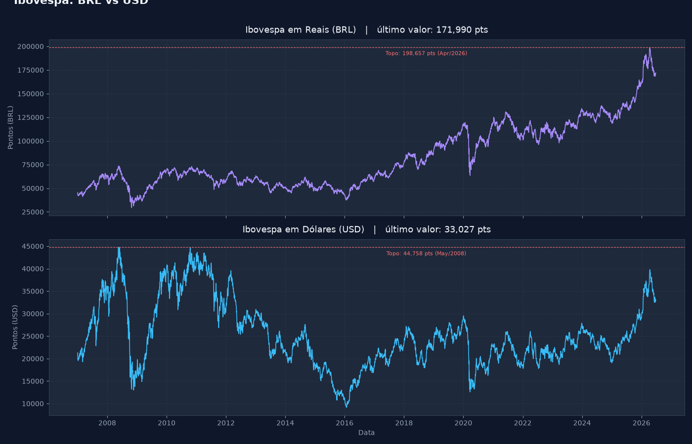

# IBOV Dolarizado

Conversão e visualização histórica do Ibovespa em dólares americanos (USD), permitindo
avaliar o desempenho da bolsa brasileira sob a ótica de um investidor internacional.

## Motivação

Analisado apenas em reais, o Ibovespa tende a registrar sucessivas máximas históricas
que refletem, em parte, a desvalorização da moeda brasileira ao longo do tempo. A
conversão para dólares expõe uma perspectiva diferente: o topo de maio de 2008, quando
o dólar custava menos de R$ 2,00, ainda supera os níveis atuais quando medidos em USD.

## O que o notebook faz

- Coleta o histórico do Ibovespa (`^BVSP`) e do câmbio USD/BRL (`USDBRL=X`) via
  Yahoo Finance, a partir de janeiro de 2007.
- Alinha as duas séries por data com merge inner, descartando dias em que apenas um
  dos mercados operou.
- Calcula o IBOV em dólares dividindo a pontuação diária pela cotação do câmbio no
  mesmo dia.
- Gera um painel comparativo com as duas séries, marcando o topo histórico de cada
  uma e exibindo o último valor no título.

## Tecnologias

- Python 3
- yfinance
- pandas
- matplotlib

## Resultados

| Item                        | Valor                   |
|-----------------------------|-------------------------|
| Período analisado           | 02/01/2007 a 25/06/2026 |
| Registros após alinhamento  | 4.862                   |
| Topo histórico em BRL       | 197.324 pts (abr/2026)  |
| Topo histórico em USD       | 42.231 pts (mai/2008)   |
| Último valor em BRL         | 171.990 pts             |
| Último valor em USD         | 33.027 pts              |

## Referências

- [Yahoo Finance](https://finance.yahoo.com)
- [Documentação yfinance](https://ranaroussi.github.io/yfinance)
- [Videoaula original - Trading com Dados](https://youtu.be/VIYxNFyajy0?si=mUWk5hUyP6PUayXF)

---

> Material desenvolvido para estudos e composição de portfólio.
> Repositório: [financas-quantitativas](https://github.com/esscova/financas-quantitativas)